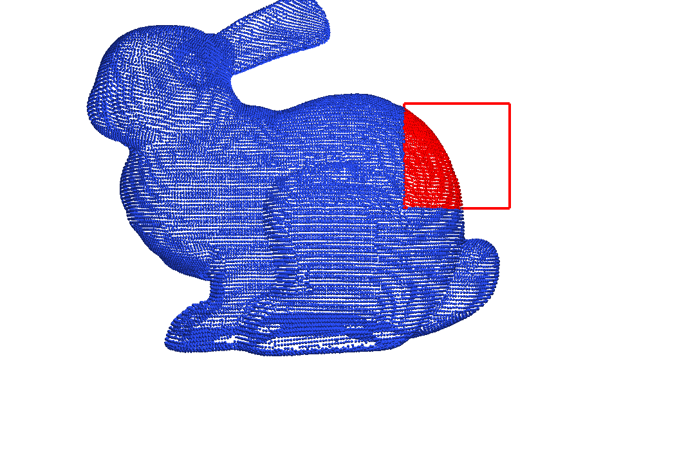

A set of visualization tools based on taichi GGUI. It intends to help debug simulation codes of taichi. 

一系列基于taichi GGUI的可视化小工具。主要目的是方便debug仿真代码。 

please see this issue:
https://github.com/taichi-dev/taichi/issues/7853

## Roadmap
- Particles/faces selector
  - [ ] By drawing a rectangle with mouse, it should return the ids of the particles/faces and highlight them.
  - [ ] It should have two modes: penatration mode and surface selection mode, like paraview.
  - APIs: 

- Sparse grid visualizer
  - [ ] It should show the activated sparse grid with wireframed box, like Houdini.
  - APIs: 


- Matrix checker
  - [ ] It should show the pattern of a sparse matrix, like the `spy()` function in `scipy` or `MATLAB`. 
  - [ ] It should show the value of the matrix, with capability of zoom in/out
  - APIs:


## Examples

### Selector

run
```
python selector.py
```

Drag the left mouse to draw the rectancle and select:


Press i to print the selected ids.

Outpus:
```
[   85   606   692   871  2478  2663  2013  3075  2911  3054  3600  4255
  5260  5521  5582  6259  7191  7722  7066  7122  8771  8820 10765 10446
 10902 10999 11857 11086 11087 11964 11991 11321 13118 14111 14112 15101
 16390 16050 16056 16935 16278 16278 17156 16878 17800 17860 19085 18708
 18781 18782 20046 20049 21030 21068 22135 23214 24166 24167 24168 24202
 25081 26818 26051 26933 26934 26935 26936 28192 29099 29919 31261 30924
 30978 30979 30403 31962 32144 32145 32146 32147 32148 32149 32457 32824
 32897 32898 32604 32899 33564 32900 33565 32901 33566 33564 33567 32960
 33611 33567 34438 33032 33775 33776]
```

API usage:
```python
# First, instantiate a selector
selector = Selector(camera, window, particle_pos)

while window.running:
  #select the particles in the rectangle when dragging the mouse
  selector.select() 

  #clear the selection when press "c"
  if window.is_pressed("c"):
      selector.clear()
  
  #print the selected particle ids when press "i"
  if window.is_pressed("i"):
      print(selector.get_ids())
  
  #draw the selected particles in red
  scene.particles(particle_pos, radius=0.01, per_vertex_color=selector.per_vertex_color)
```